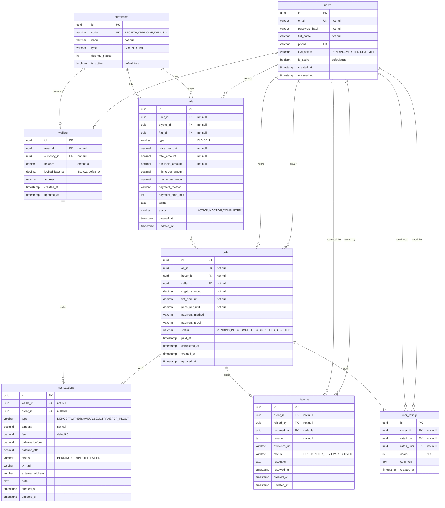

# Crypto Exchange Backend

P2P (C2C) cryptocurrency exchange API — NestJS, TypeORM, PostgreSQL.

## Tech Stack

- **NestJS** (TypeScript), **TypeORM**, **PostgreSQL**
- **JWT + Passport** — authentication
- **Docker** — run PostgreSQL

## Project Structure

```
src/
├── config/           Database and app config
├── common/           Guards, decorators
├── database/
│   ├── entities/     TypeORM entities
│   ├── migrations/
│   └── seeds/
└── modules/
    ├── auth/         Register, login, JWT
    ├── users  currencies  wallets  transactions
    ├── ads    orders      disputes
```

## Getting Started

```bash
git clone <repo-url>
cd backend
npm install
cp .env.example .env
docker-compose up -d
npm run migration:run
npm run seed
npm run start:dev
```

Server: **http://localhost:3000**

Use values from `.env.example` (matches docker-compose: `crypto` / `crypto_secret` / `crypto_exchange`). If port 5432 is in use, set `DB_PORT=5433` and update `ports` in `docker-compose.yml`.

## Auth

- **Access token** — send in header `Authorization: Bearer <token>` for protected endpoints.
- **Refresh token** — exchange at `POST /auth/refresh` with body `{ "refreshToken": "..." }`.

## API Overview

| Method | Endpoint | Description |
|--------|----------|-------------|
| POST | /auth/register | Register (returns access_token + refresh_token) |
| POST | /auth/login | Login |
| POST | /auth/refresh | Issue new tokens with refresh_token |
| POST | /auth/logout | Revoke refresh_token |
| GET | /auth/me | Current user |
| GET | /wallets | List wallets with currency |
| GET | /wallets/by-currency/:currency | Wallet by currency code |
| GET | /wallets/:id/transactions | Transaction history |
| GET | /ads | List ads (?type=SELL&crypto=BTC) |
| GET | /orders/:id | Order with relations |
| GET | /disputes/:id | Dispute |

**Swagger:** http://localhost:3000/api

## Seed Data

After `npm run seed`:

- **Currencies:** BTC, ETH, XRP, DOGE, THB, USD
- **Users:** alice@example.com, bob@example.com, admin@example.com — passwords: alice123, bob123, admin123
- **Wallets, ads, orders:** sample data for testing

## ER Diagram



## Scripts

| Command | Description |
|--------|-------------|
| npm run start:dev | Start dev server (watch) |
| npm run build | Build project |
| npm run migration:run | Run migrations |
| npm run migration:revert | Revert last migration |
| npm run seed | Load seed data |
